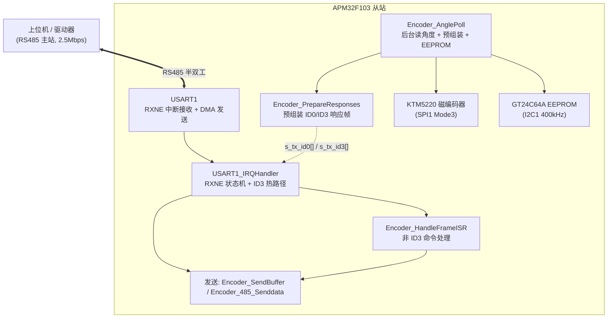
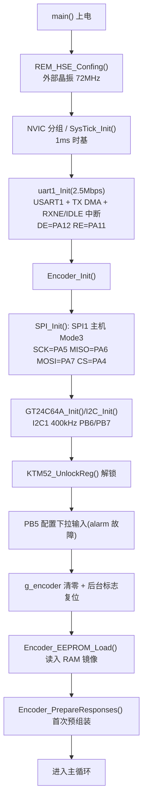
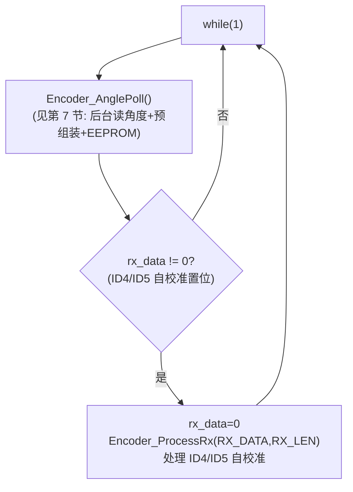
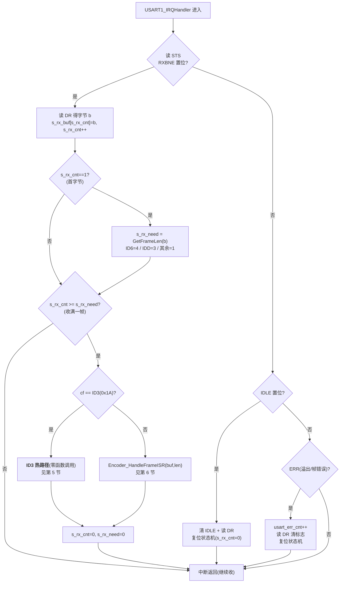
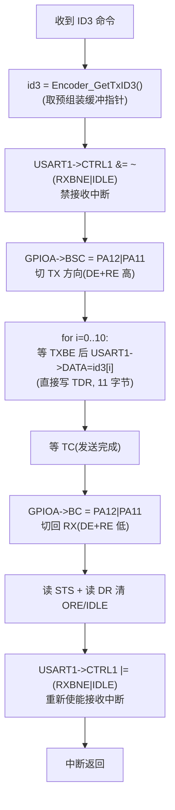
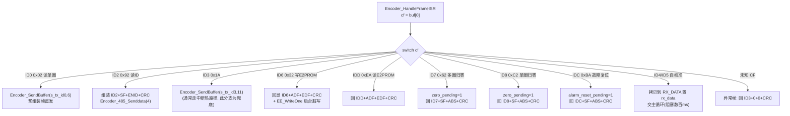
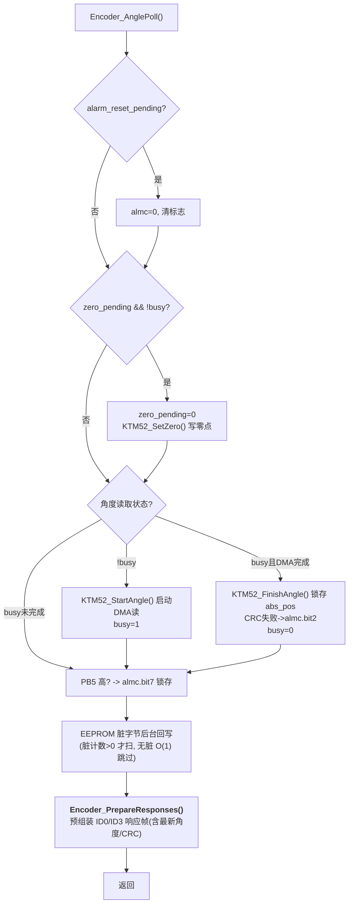
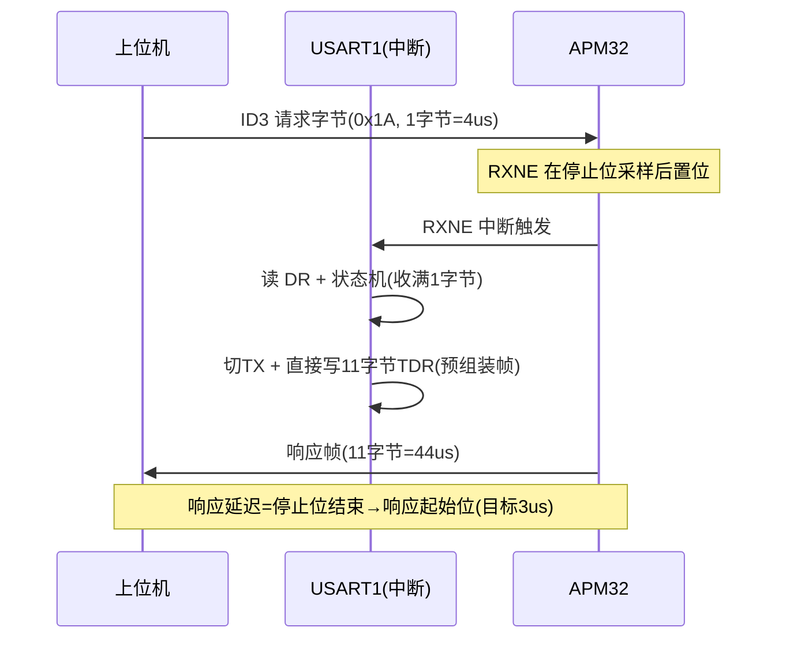

# APM32 编码器模拟器 —— 代码流程图（当前版本）

> 本图反映**最新优化后**的代码逻辑：RS485 接收采用 **RXNE 逐字节中断 + 状态机**，
> 读角度命令（ID0/ID3）响应帧**后台预组装**、中断内**零组装直发**，追求 ≤3us 响应。

涉及文件：`main.c`、`uart.c/.h`、`485.c/.h`、`spi.c`、`ktm52.c`、`i2c.c`、`gt24c64a.c`

---

## 1. 系统架构总览

---

## 2. 上电初始化流程

---

## 3. 主循环流程（main.c）

> 注意：ID0/2/3/6/D/7/8/C 等命令**全部在 USART1 中断里处理完**，不再走主循环；
> 只有 ID4/ID5（自校准，阻塞数百 ms）通过 `rx_data` 标志交主循环。

---

## 4. USART1 中断处理（uart.c，核心）

---

## 5. ID3 热路径（中断内零函数调用直发）

> 特点：整个 ID3 响应**不经过任何函数调用和库函数**，只做直接寄存器操作，
> 把响应延迟压到最低（这是从 5us 优化到 3us 的关键）。

---

## 6. 命令处理（Encoder_HandleFrameISR，非 ID3 命令）

---

## 7. 后台轮询（Encoder_AnglePoll，主循环每轮调用）

---

## 8. 读角度命令完整时序（RXNE 中断 → 响应）

---

## 9. 关键全局变量 / 缓冲

| 名称 | 位置 | 说明 |
|---|---|---|
| `s_rx_buf[8]` | uart.c | 接收状态机字节缓冲 |
| `s_rx_cnt` / `s_rx_need` | uart.c | 已收字节数 / 本帧总字节数 |
| `s_tx_id0[6]` / `s_tx_id3[11]` | 485.c | 预组装响应帧（后台更新） |
| `g_encoder` | 485.c | 编码器上下文（abs_pos/sf/almc/enid/后台标志） |
| `DMA_USART1_TxBuf[64]` | uart.c | 通用发送缓冲（非预组装命令用） |
| `s_ee_ram[]` / `s_ee_dirty[]` | 485.c | EEPROM RAM 镜像 / 脏位图 |
| `s_ee_dirty_count` | 485.c | 脏字节计数（无脏时 O(1) 跳过扫描） |

---

## 10. 响应延迟优化历程（供参考）

| 阶段 | 方案 | 延迟 |
|---|---|---|
| 初始 | DMA+IDLE 接收 + 主循环处理 | ~100us（抖动） |
| 优化1 | IDLE 中断内响应 | ~11us |
| 优化2 | RXNE 中断 + 状态机 | ~8us |
| 优化3 | 后台预组装 + 零拷贝直发 | ~5us |
| 优化4 | ID3 中断内直接寄存器操作 | ~3us（目标） |
